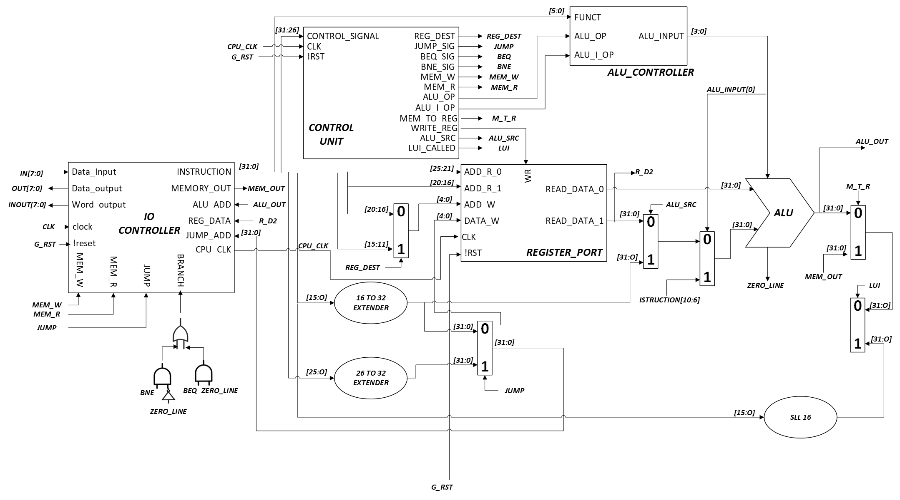

<!---

This file is used to generate your project datasheet. Please fill in the information below and delete any unused
sections.

You can also include images in this folder and reference them in the markdown. Each image must be less than
512 kb in size, and the combined size of all images must be less than 1 MB.
-->

## How it works

This project implements a **single-cycle 32-bit MIPS processor**.  
It supports the standard MIPS instruction set, with a few exceptions that will be discussed later.

Due to the limited number of digital pins, the interfacing with the processor, dataflow control, and memory management are delegated to external hardware, which will be described in the *External hardware* section.

As shown in the figure above, the system is composed of two main blocks:

- the **I/O Controller**  
- the **Processor core**

The I/O Controller is the module directly connected to the SoC physical pins, following the layout below:

| # | Input         | Output      | Bidirectional   |
|---|--------------|-------------|----------------|
| 0 | instruction[0] | data_out[0] | address_out[0] |
| 1 | instruction[1] | data_out[1] | address_out[1] |
| 2 | instruction[2] | data_out[2] | address_out[2] |
| 3 | instruction[3] | data_out[3] | address_out[3] |
| 4 | instruction[4] | data_out[4] | address_out[4] |
| 5 | instruction[5] | data_out[5] | address_out[5] |
| 6 | instruction[6] | data_out[6] | address_out[6] |
| 7 | instruction[7] | data_out[7] | address_out[7] |

The **32-bit instruction** is provided **8 bits at a time** through the input pins.  
Once the instruction is fully received, the processor executes it in **one clock cycle**. The subsequent behavior depends on the instruction type:

- **R-type and most I-type instructions** (*excluding LW, SW, BEQ, BNE*):  
  After execution, the controller is immediately ready to receive the next instruction.

- **J-type, BEQ, and BNE**:  
  The controller outputs the target address, 8 bits at a time, **without applying the offset**. If the branch/jump is taken, the full address is provided; otherwise, zero is output. The controller is then ready for the next instruction.

- **SW (Store Word)**:  
  The controller outputs, in parallel and 8 bits at a time, both the memory address (`address_out`) and the word to be stored (`data_out`). Once completed, the controller is ready for the next instruction.

- **LW (Load Word)**:  
  The controller outputs, 8 bits at a time, the memory address to be read.  
  Then, one *stall cycle* occurs to allow the external system to fetch the data.  
  Afterward,the address_out port is setted as 0xFF to signal that the controller is ready to receive the word wich has to be provided back to the processor 8 bits at a time through the instruction port. The controller is then ready for the next instruction.

---
  **About the ISA:**
The following table lists all the standard and if it is implemented or not **MIPS istruction set:**

### MIPS32 Standard Instruction Set:

| Category              | Mnemonic | Format | Operation / Description                                | Implemented |
|-----------------------|----------|--------|--------------------------------------------------------|-------------|
| **Arithmetic (R-type)** | `add`    | R      | `rd = rs + rt` (with overflow)                         | ⚠️  as usigned |
|                       | `addu`   | R      | `rd = rs + rt` (no overflow)                           | ✅ |
|                       | `sub`    | R      | `rd = rs - rt` (with overflow)                         | ⚠️  as usigned |
|                       | `subu`   | R      | `rd = rs - rt` (no overflow)                           | ✅ |
|                       | `mult`   | R      | `{HI, LO} = rs * rt` (signed)                          | ❌ |
|                       | `multu`  | R      | `{HI, LO} = rs * rt` (unsigned)                        | ❌ |
|                       | `div`    | R      | `{LO = rs / rt, HI = rs % rt}` (signed)                | ❌ |
|                       | `divu`   | R      | `{LO = rs / rt, HI = rs % rt}` (unsigned)              | ❌ |
| **Logical (R-type)**  | `and`    | R      | `rd = rs & rt`                                         | ✅ |
|                       | `or`     | R      | `rd = rs \| rt`                                        | ✅ |
|                       | `xor`    | R      | `rd = rs ^ rt`                                         | ✅ |
|                       | `nor`    | R      | `rd = ~(rs \| rt)`                                     | ✅ |
| **Shifts (R-type)**   | `sll`    | R      | `rd = rt << shamt`                                     | ✅ |
|                       | `srl`    | R      | `rd = rt >> shamt` (logical)                           | ✅ |
|                       | `sra`    | R      | `rd = rt >> shamt` (arithmetic)                        | ❌ |
|                       | `sllv`   | R      | `rd = rt << rs`                                        | ❌ |
|                       | `srlv`   | R      | `rd = rt >> rs` (logical)                              | ❌ |
|                       | `srav`   | R      | `rd = rt >> rs` (arithmetic)                           | ❌ |
| **Move / HI-LO**      | `mfhi`   | R      | `rd = HI`                                              | ❌ |
|                       | `mflo`   | R      | `rd = LO`                                              | ❌ |
|                       | `mthi`   | R      | `HI = rs`                                              | ❌ |
|                       | `mtlo`   | R      | `LO = rs`                                              | ❌ |
| **Comparison**        | `slt`    | R      | `rd = (rs < rt)` (signed)                              | ⚠️  as usigned |
|                       | `sltu`   | R      | `rd = (rs < rt)` (unsigned)                            | ✅ |
| **Immediate (I-type)**| `addi`   | I      | `rt = rs + imm` (with overflow)                        | ⚠️  as usigned |
|                       | `addiu`  | I      | `rt = rs + imm` (no overflow)                          | ✅ |
|                       | `andi`   | I      | `rt = rs & imm`                                        | ✅ |
|                       | `ori`    | I      | `rt = rs \| imm`                                       | ✅ |
|                       | `xori`   | I      | `rt = rs ^ imm`                                        | ✅ |
|                       | `lui`    | I      | `rt = imm << 16`                                       | ✅ |
|                       | `slti`   | I      | `rt = (rs < imm)` (signed)                             | ⚠️  as usigned |
|                       | `sltiu`  | I      | `rt = (rs < imm)` (unsigned)                           | ✅ |
| **Memory Access**     | `lw`     | I      | `rt = Mem[rs + offset]`                                | ✅ |
|                       | `sw`     | I      | `Mem[rs + offset] = rt`                                | ✅ |
|                       | `lh`     | I      | `rt = sign_ext(Mem[rs + offset][15:0])`                | ❌ |
|                       | `lhu`    | I      | `rt = zero_ext(Mem[rs + offset][15:0])`                | ❌ |
|                       | `sh`     | I      | `Mem[rs + offset][15:0] = rt[15:0]`                    | ❌ |
|                       | `lb`     | I      | `rt = sign_ext(Mem[rs + offset][7:0])`                 | ❌ |
|                       | `lbu`    | I      | `rt = zero_ext(Mem[rs + offset][7:0])`                 | ❌ |
|                       | `sb`     | I      | `Mem[rs + offset][7:0] = rt[7:0]`                      | ❌ |
| **Branches (I-type)** | `beq`    | I      | if `(rs == rt)` branch to `PC + offset`                | ✅ |
|                       | `bne`    | I      | if `(rs != rt)` branch to `PC + offset`                | ✅ |
|                       | `blez`   | I      | if `(rs <= 0)` branch to `PC + offset`                 | ❌ |
|                       | `bgtz`   | I      | if `(rs > 0)` branch to `PC + offset`                  | ❌ |
|                       | `bltz`   | I      | if `(rs < 0)` branch to `PC + offset`                  | ❌ |
|                       | `bgez`   | I      | if `(rs >= 0)` branch to `PC + offset`                 | ❌ |
| **Jumps (J-type)**    | `j`      | J      | Jump to target address                                  | ✅ |
|                       | `jal`    | J      | `ra = PC + 4; jump to target`                          | ⚠️  as jump |
| **Jumps (R-type)**    | `jr`     | R      | Jump to address in `rs`                                | ❌ |
|                       | `jalr`   | R      | `ra = PC + 4; jump to address in rs`                   | ❌ |
| **Trap/Break**        | `syscall`| R      | Exception for system call                               | ❌ |
|                       | `break`  | R      | Breakpoint exception                                   | ❌ |
|                       | `eret`   | R      | Return from exception (Coprocessor 0)                  | ❌ |

---

⚠️ **Important note:**  
 All 8-bit communications **must begin from the Least Significant Byte (LSB) and end with the Most Significant Byte (MSB)**.

---

## How to test

Depending on the instruction format, a MIPS instruction is organized as follows:

###  MIPS formats (R, I, J)

| Tipo di istruzione | Campo               | Bit 31-26 | Bit 25-21 | Bit 20-16 | Bit 15-11 | Bit 10-6  | Bit 5-0    |
|--------------------|----------------------|-----------|-----------|-----------|-----------|-----------|------------|
| **R-type**         | opcode              | opcode    | rs        | rt        | rd        | shamt     | funct       |
| **I-type**         | opcode, rs, rt, imm | opcode    | rs        | rt        | immediate (bits 15-0)              | –         | –          |
| **J-type**         | opcode, address     | opcode    | address (bits 25-0)                                      | –         | –          | –          |

The following table lists the bit masks for each implemented instruction:

### Implemented MIPS32 Subset (with Encoding)

| Mnemonic | Format | Description                          | Opcode (6b) | Funct (6b) | Notes |
|----------|--------|--------------------------------------|-------------|------------|-------|
| `addu`   | R      | `rd = rs + rt` (no overflow)         | 000000      | 100001     | ✅ |
| `add`    | R      | `rd = rs + rt` (overflow, treated unsigned) | 000000      | 100000     | ⚠️ implemented as unsigned |
| `subu`   | R      | `rd = rs - rt` (no overflow)         | 000000      | 100011     | ✅ |
| `sub`    | R      | `rd = rs - rt` (overflow, treated unsigned) | 000000      | 100010     | ⚠️ implemented as unsigned |
| `and`    | R      | `rd = rs & rt`                      | 000000      | 100100     | ✅ |
| `or`     | R      | `rd = rs \| rt`                     | 000000      | 100101     | ✅ |
| `xor`    | R      | `rd = rs ^ rt`                      | 000000      | 100110     | ✅ |
| `nor`    | R      | `rd = ~(rs \| rt)`                  | 000000      | 100111     | ✅ |
| `sll`    | R      | `rd = rt << shamt`                  | 000000      | 000000     | ✅ |
| `srl`    | R      | `rd = rt >> shamt` (logical)        | 000000      | 000010     | ✅ |
| `sltu`   | R      | `rd = (rs < rt)` (unsigned)         | 000000      | 101011     | ✅ |
| `slt`    | R      | `rd = (rs < rt)` (signed, as unsigned) | 000000      | 101010     | ⚠️ implemented as unsigned |
| `addi`   | I      | `rt = rs + imm` (overflow, treated unsigned) | 001000      | -          | ⚠️ implemented as unsigned |
| `addiu`  | I      | `rt = rs + imm` (no overflow)       | 001001      | 000000          | ✅ |
| `andi`   | I      | `rt = rs & imm`                     | 001100      | 000000          | ✅ |
| `ori`    | I      | `rt = rs \| imm`                    | 001101      | 000000          | ✅ |
| `xori`   | I      | `rt = rs ^ imm`                     | 001110      | 000000          | ✅ |
| `lui`    | I      | `rt = imm << 16`                    | 001111      | 000000          | ✅ |
| `sltiu`  | I      | `rt = (rs < imm)` (unsigned)        | 001011      | 000000          | ✅ |
| `slti`   | I      | `rt = (rs < imm)` (signed, as unsigned) | 001010      | 000000          | ⚠️ implemented as unsigned |
| `lw`     | I      | `rt = Mem[rs + offset]`             | 100011      | 000000          | ✅ |
| `sw`     | I      | `Mem[rs + offset] = rt`             | 101011      | 000000          | ✅ |
| `beq`    | I      | if `(rs == rt)` branch              | 000100      | 000000          | ✅ |
| `bne`    | I      | if `(rs != rt)` branch              | 000101      | 000000          | ✅ |
| `j`      | J      | Jump to target                     | 000010      | 000000          | ✅ |

## External hardware

Any microcontroller capable of executing the **Input Controller** algorithm and managing the processor’s memory and dataflow.